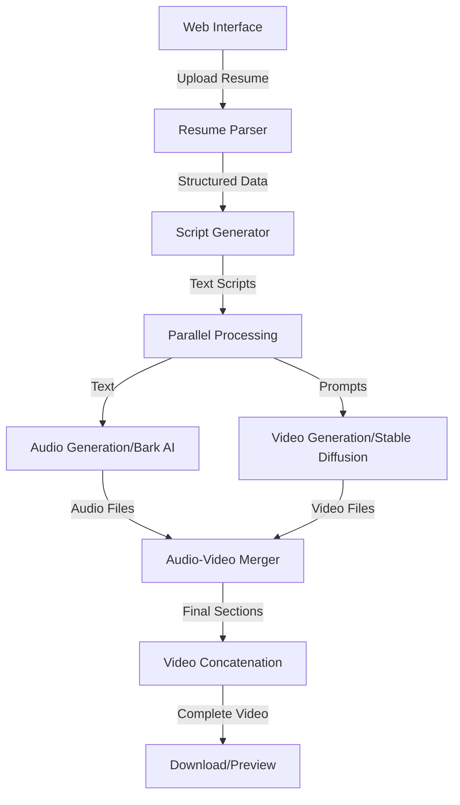

# AI-Powered Video Resume Generator

A cutting-edge application that transforms traditional resumes into engaging video presentations using AI technology. This project leverages Streamlit for the frontend, Stable Video Diffusion for video generation, and Bark for audio synthesis.

## 🌟 Features

- **Intuitive Web Interface**: Clean, responsive UI built with Streamlit
- **Secure Authentication**: User login system with database integration
- **AI-Powered Generation**:
  - Converts resume text to natural speech using Bark AI
  - Generates relevant video content using Stable Video Diffusion
  - Automatically merges audio and video with captions
- **Section-Based Processing**:
  - Introduction
  - Experience
  - Skills
  - Achievements
  - Goals
  - Contact Information

## 🏗️ Architecture



## 🛠️ Technology Stack

- **Frontend**: Streamlit
- **AI Models**:
  - Stable Video Diffusion for video generation
  - Bark AI for text-to-speech
- **Video Processing**: MoviePy
- **Database**: MySQL
- **Authentication**: Custom implementation with database integration
- **Configuration**: YAML-based configuration

## 📁 Project Structure

```
Capstone_Project/
├── 1_🏠_Home.py                # Main application entry
├── pages/
│   ├── 2_🔒_Login.py          # Authentication page
│   └── 3_⬆️_Upload_Resume.py   # Resume upload and processing
├── src/
│   ├── db/                     # Database connections
│   ├── util/
│   │   ├── video_generation_final.py  # Video generation utilities
│   │   └── format_summary.py          # Text formatting utilities
│   ├── video/                  # Generated video segments
│   ├── merged_video/          # Processed video sections
│   └── final_video/           # Final concatenated videos
├── img/                        # UI assets
├── config.yaml                 # Application configuration
└── setup.py                   # Project dependencies and packaging
```

## 🚀 Setup and Installation

1. Clone the repository:
   ```bash
   git clone https://github.com/TS-Group5/Capstone_Project.git
   ```

2. Install dependencies:
   ```bash
   pip install -e .
   ```

3. Configure the database:
   - Update database credentials in config.yaml
   - Ensure MySQL server is running

4. Run the application:
   ```bash
   streamlit run 1_🏠_Home.py
   ```

## 💻 Usage

1. Access the web interface
2. Log in with your credentials
3. Upload your resume (DOCX format)
4. Wait for the AI to process your resume
5. Preview and download your video resume

## ⚙️ Configuration

The application uses a `config.yaml` file for managing:
- API endpoints
- Database connections
- Model parameters
- File paths

## 🔒 Security Features

- Secure password handling
- Session management
- Protected routes
- Environment-based configurations

## 🤝 Contributing

1. Fork the repository
2. Create your feature branch
3. Commit your changes
4. Push to the branch
5. Create a Pull Request

## 📝 License

This project is licensed under the MIT License - see the LICENSE file for details.

## 👥 Authors

- AIMLOPS - G5 - Initial work and maintenance

## 🙏 Acknowledgments

- Stability AI for Stable Video Diffusion
- Bark team for the text-to-speech model
- Streamlit team for the amazing web framework